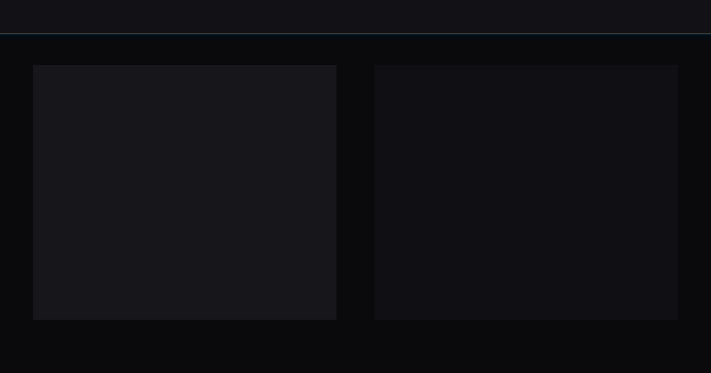

# Claude Intent Extraction Demo

Turn natural-language search queries into structured JSON filters using the Claude API and `tool_use`.

**Live demo:** [intent-demo.xplor.io](https://intent-demo.xplor.io) ← (update once deployed)



---

## What this is

A minimal, production-shaped example of using Claude as an intent extraction engine — the same technique used in production at [Xplor.io](https://xplor.io) to convert charter-client search queries into structured filters against a 12,757-yacht database.

Type a query like *"Caribbean catamaran for 8 guests in February under €80k"* and Claude returns a typed JSON object with destination, vessel type, guests, budget, and confidence — guaranteed to match the schema.

## Why tool_use, not "output JSON" prompting

Most LLM extraction tutorials still tell Claude to "output only JSON" in a system prompt and parse the result. That works ~95% of the time and fails noisily in production (markdown fences, trailing commas, hallucinated fields).

This demo uses Claude's `tool_use` API instead. The schema is defined as a tool; the API guarantees the response matches it. Zero parsing failures.

## Engineering decisions

- **Model:** `claude-haiku-4-5` — fast and cheap. Intent extraction doesn't need Sonnet or Opus; using the right model is part of the job.
- **Schema enforcement:** `tool_use` with `tool_choice: { type: "tool", name: "..." }` forces a structured response.
- **Server-side only:** API key lives in `.env`, never reaches the browser.
- **Rate limiting:** Vercel KV with sliding 60s window per IP. Local dev gracefully degrades when KV isn't configured.
- **Latency measured, not estimated:** Real `performance.now()` deltas returned in every response.

## Accuracy

I ran 20 hand-written queries against this setup. Results in [`docs/evals.md`](./docs/evals.md).

## Run locally

```bash
git clone https://github.com/jd215/claude-intent-extraction-demo.git
cd claude-intent-extraction-demo
npm install
cp .env.example .env
# Add your ANTHROPIC_API_KEY to .env
npm run dev
```

Open `http://localhost:3000`.

## Deploy to Vercel

```bash
vercel
```

Set `ANTHROPIC_API_KEY` in the Vercel project settings. For production rate limiting, also provision Vercel KV and set `KV_REST_API_URL` and `KV_REST_API_TOKEN`.

## Customise for your domain

The yacht-charter schema in `server/api/extract.post.ts` is just an example. Replace the tool's `input_schema` with your own domain (real estate, e-commerce, restaurants, etc.) and the same pattern works.

## About

Built by [Johnny Drummond](https://xplor.io/jd) — AI-Native Full-Stack Engineer based in Mallorca. Available for AI integration projects and fractional CTO engagements.

[xplor.io](https://xplor.io) · [LinkedIn](https://linkedin.com/in/johnnydrummond) · jd@xplor.io

## License

MIT
